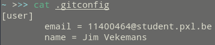
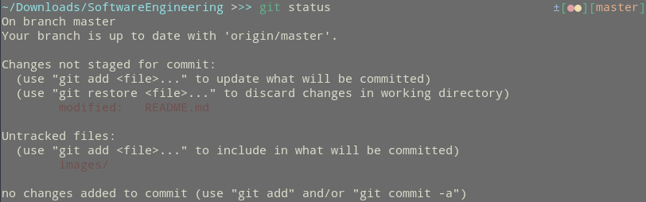
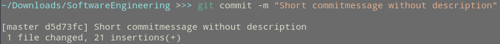

# Design Patterns

### Wat moet je kennen en kunnen? 

Design Patterns kunnen aan bod komen zowel in het schriftelijk  (gesloten boek) gedeelte als in het het praktische laptopgedeelte (open  boek).

Volgende Design Patterns zijn behandeld:

- Strategy
- Observer
- Decorator
- Factory
- Singleton
- Command
- Template Method
- Composite / Iterator
- State

##### Schriftelijk, gesloten boek

- Een Design Pattern kunnen defiëren: wat is het? UML klassendiagram tekenen en de verschillende klassen verklaren.
- Een Design Pattern kunnen herkennen aan de hand van voorbeeldcode en/of een voorbeeld UML diagram.
- Aan de hand van een probleembeschrijving een oordeelkundige keuze  kunnen maken tussen Design Patterns: welke zou je hier het best  toepassen en waarom?

##### Praktisch, laptop (C#)

- Een oefening waarbij via een probleembeschrijving een Design Pattern dient gekozen (zie voorbeeldvraag)
- Voorbeeldcode herwerken (refactoren) tot een (eventueel  opgelegde) Design Pattern gebruikt wordt. Bijvoorbeeld: herwerk dit  switch-statement zodat je een Command patroon gebruikt.

# Git

### Config
  - system level config: `git config --system` stored in <u>/etc/gitconfig</u>
  - user level config: `git config --global` stored in <u>~/.gitconfig</u>
  - repository level config: `git config` stored in <u>./.git/config</u>
  
    

### Staging

  - Marking the files which have been modified (or selecting ones that are about to be modified)
  - `git status` to check the current modified / added / deleted files that are not staged. `git add` or `git rm` to add or remove the file / folder.

> Use this to <u>split work into commits that relate to the same issue</u>. e.g. if you change both front- and backend files, split the modified files up into separate commits using add ./backend, committing, adding ./frontend and committing again. This makes it easier to trace issues back to the commit previous to the issue.

### Commits
There are 2 main ways to commit
  - `git commit` where the user provides a summary and a more detailed message explaining the changes to the file.
  - `git commit -m ""` where there is a short message supplied for the commitmessage

> If there are files that should have been committed previously, you can use `git commit --amend` to add them to the previous commit.

##### Tagging
Tagging a commit makes the commit easily retraceable by assign a sort of "name" for a commit along with the usual hashcode for a commit.
- usage: `git tag -a {annotation} -m {tagmessage}`

### Branching

- checkout: 
  - `git checkout HEAD {file}` to reset an unstaged file back to the version that was last committed to the current branch
  - `git checkout `
- reset
- clean
- revert

  

### Wat moet je kennen en kunnen? 

Git kan aan bod komen zowel in het schriftelijk (gesloten boek) gedeelte als in het praktisch laptopgedeelte (open boek).

##### Schriftelijk, gesloten boek

- Kort kunnen situeren waarom git bedacht is
- Git principes kunnen uitleggen: staging, commit, push, pull, merge, rebase, etc.
- De interne werking van git kunnen uitleggen en verklaren
- Kunnen schetsen welke workflows voor teams mogelijk zijn als je git gebruikt

##### Praktisch, laptop

Op het examen zou je een git repo gegeven kunnen hebben, waarover je een aantal vragen moet kunnen beantwoorden. Hierbij zal je  dagdagelijkse git commando's moeten gebruiken (je moet het gebruikte  commando noteren) en/of je inzicht in de interne werking van git moeten  aantonen. Bijvoorbeeld:

- Hoeveel branches zitten in deze repo?
- Hoeveel commits tel je?
- Wie heeft de meest recente commit gedaan?
- Merge branch A en branch B, wat voor soort merge was dit?
- Teken een eenvoudig object database die git voor deze repo bijhoudt
- enz.

# SOLID Principles

### Wat moet je kennen en kunnen? 

SOLID kan aan bod komen zowel in het schriftelijk (gesloten boek) als in het praktische gedeelte (open boek).

##### Schriftelijk, gesloten boek

- De SOLID principes kunnen opsommen en kort beschrijven
- Op basis van gedrukte broncode op papier aangeven welk van de SOLID principes geschonden zijn en hoe je dit kan oplossen

##### Praktisch, laptop (C#)

- Een oefening zoals de voorbeelden uit de cursus, waarbij een  refactoring dient gemaakt te worden op basis van één van de  SOLID-principes